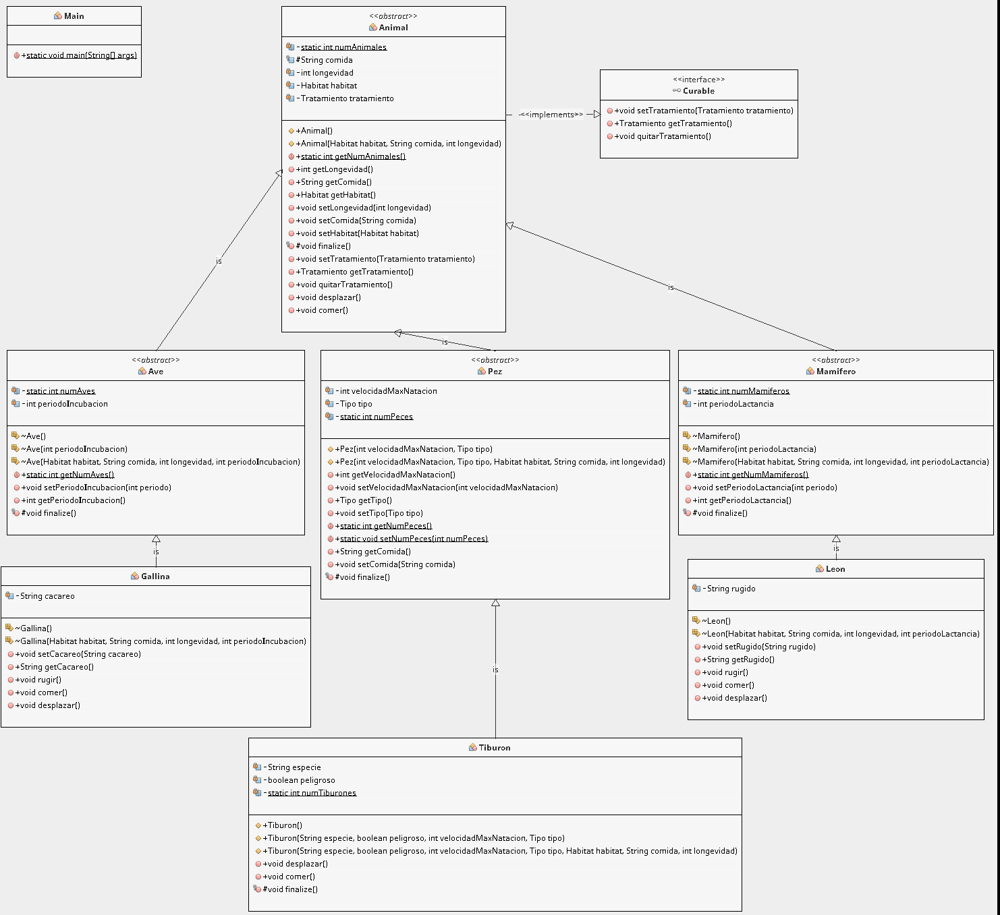

# Zoo
JAVA: Jerarquía de clases 

**Proyecto Java (construido con Gradle) para mostrar el trabajo con jerarquía de clases**.

## Diagrama de clases

>  Diagrama realizado con el plugin EasyUML de Netbeans
